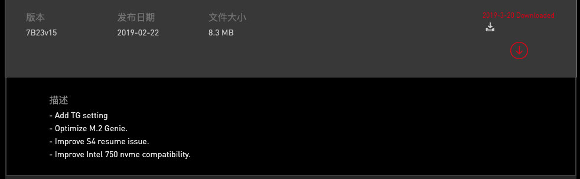
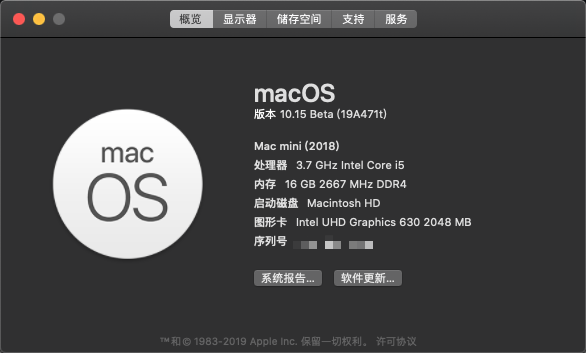
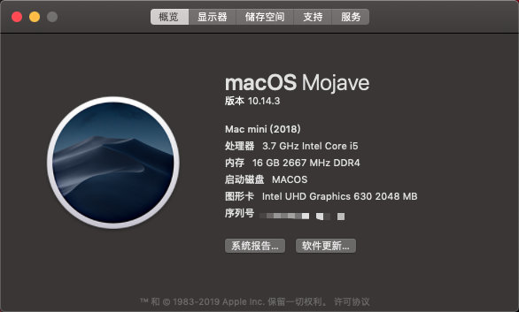
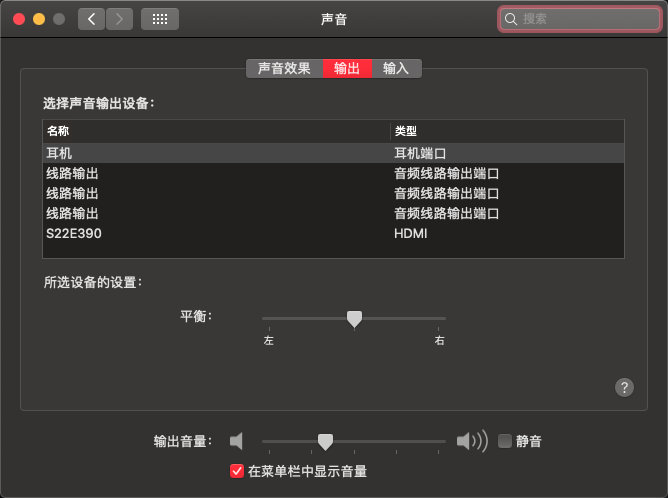
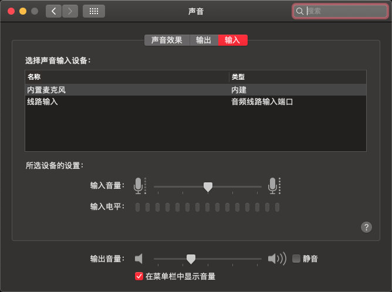
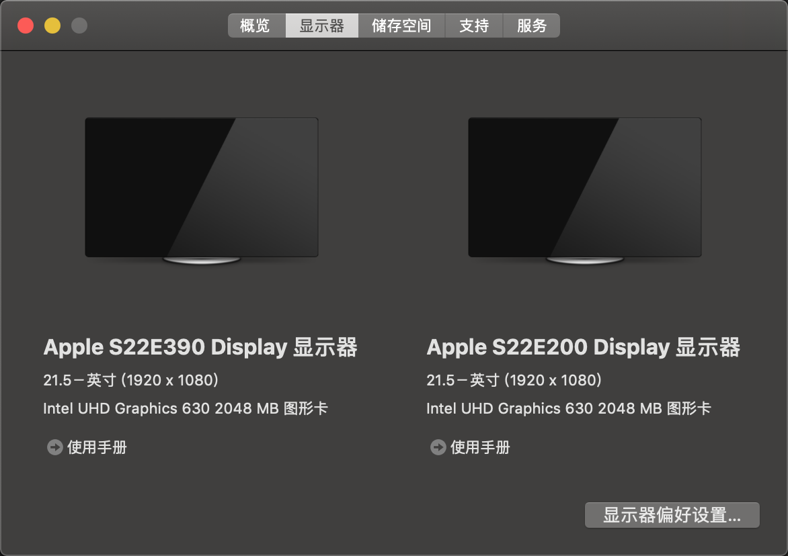
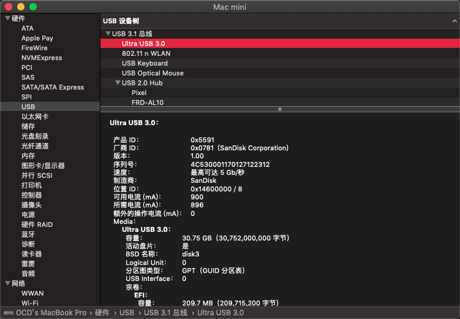
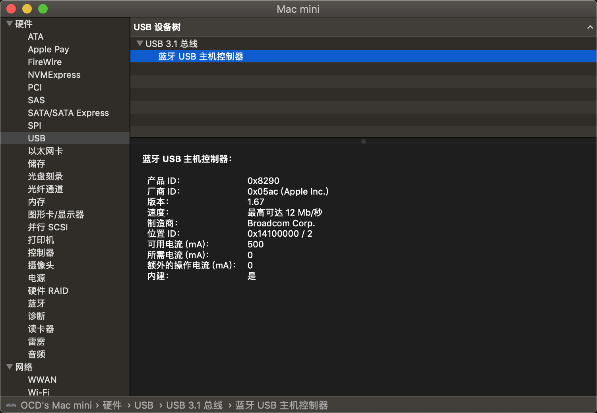

# Download
[Download](https://github.com/OCD0711/MSI-B360M-EFI/releases "点击跳转下载页")

# BUG
* ~~Boot animation blinking~~
* You tell me

# Changelog

## 2019/06/29
* Fix bug

## 2019/06/27
* Update Clover 4977
* Replace OsxAptioFixDrv-64.efi with OsxAptioFix2Drv-free2000.efi & Enhanced compatibility
* Contain more updates

## 2019/06/20
* Fix bug
* Improve stability

## 2019/06/05 (放假前更新最后一次修bug啦..., 目前来说 用这个 EFI 10.15 beta 没任何问题..10.14的话更别说了...溜~)
* Update clover 4945
* Remove temporary fix 10.15
* Add USB Port limit patch #2 10.15.x modify by DalianSky
* Add USB port limit patch #1 10.15.x modify by DalianSky(credit ydeng)
* Disable panic kext logging on 10.15.4 Release kernel
* fix bug

## 2019/06/04 (Support 10.15 beta) update3
* Remove USBInjectAll
* Fix usb

## 2019/06/04 (Support 10.15 beta) update2
* fix bug
* Update clover 4939

## 2019/06/04 (Support 10.15 beta)
* Update clover 4937 (support Macos 10.15 beta)
* Update virtualsmc 1.0.5 (support Macos 10.15 beta)
* Update WhateverGreen (support Macos 10.15 beta)
* Update AppleALC (support Macos 10.15 beta)
* Update Lilu (support Macos 10.15 beta)
* Add KernelPath fix 10.15 (temporary)

## Update 2019/06/03
* Fix USBPorts.kext
* Add SSDT fix usb

## Update 2019/06/01
* Fix bug

## Update 2019/05/31
* Update Clover 4934
* Add customary USBPorts.kext (Internal HS01  Bluetooth)
* Remove EmuVariableUefi-64.efi, fix [#2](https://github.com/OCD0711/MSI-B360M-EFI/issues/2)
* Add AptioMemoryFix-64.efi, fix NVRAM
* Update IntelMausiEthernet.kext

## Update 2019/05/16
* Update Clover 4928 && Update AppleALC 1.3.7
* Support macOS Mojave 10.14.5
* Update Clover 4925
* Replace FakeSMC with VirtualSMC
* Add SMCProcessor.kext、SMCSuperIO.kext
* Remove HibernationFixup.kext
* Improve performance and stability

## Update 2019/04/19
* update clover v4920
* update kexts

## Update 2019/03/25
* Fix hdmi (display of screen is messed.)
* update clover v4901

## Update 2019/03/23
* Fix hdmi (display of screen is messed.)

## Update 2019/03/20

* ### Fix Boot in BIOS version 7B23v15
* Add ACPI Patch(Fix RTC _STA bug)

## Update 2019/03/19

* ### Fix Audio (Layout ID 15) and use Hackintool driver UHD630
* Update Clover version 4898 support macOS 10.14.4 beta6

* ### It is highly recommended to upgrade to the latest version to solve USB problems

***

CPU:i5 9600K/i7 9900K

GPU:UHD630

SSD:HS-SSD-C2000

SMBIOS:2018 Mac mini

## How to update
* install git
* git pull

## MSI B360M Mortar Hackintosh EFI FILE

    macOS Mojave 10.14.5

    Clover version:4925

    WhateverGreen 1.2.6

    HibernationFixup 1.2.4

    Lilu version:1.3.1

    AppleALC: 1.3.7

    DP: OK

    HDMI: OK

    WIFI: OK (BCM943602CS)

    Bluetooth: OK (BCM943602CS)
    
~~### Recommend BIOS version 7B23v13,the latest version is not compatible~~

MSI B360M BIOS download link https://cn.msi.com/Motherboard/support/B360M-MORTAR

### Can use BIOS version 7B23v16

